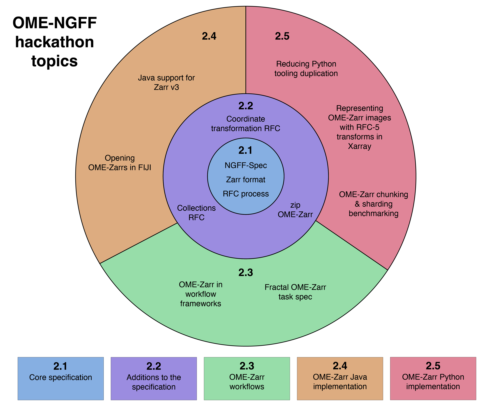
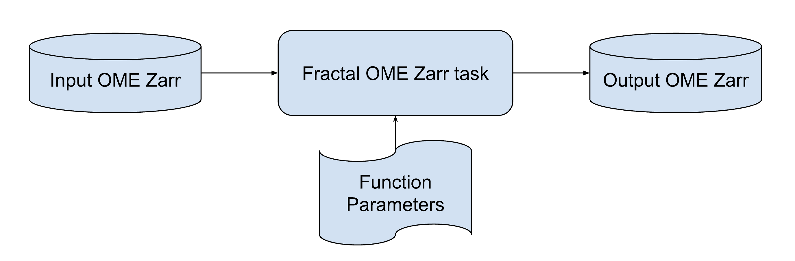
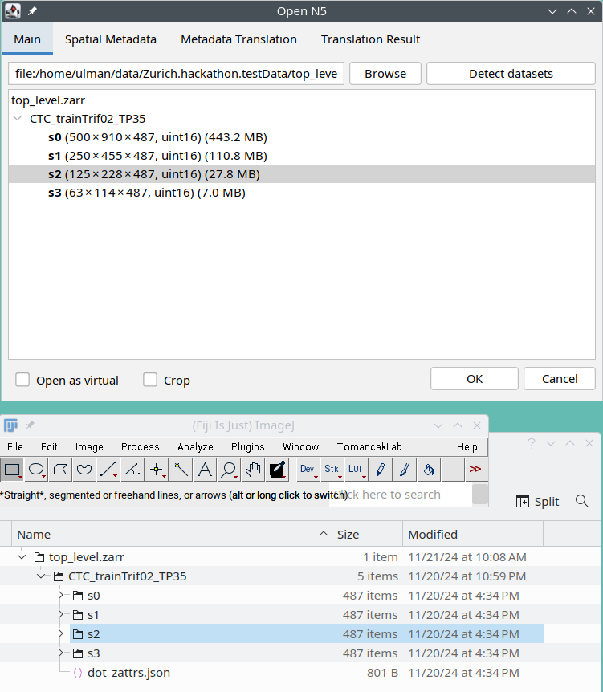
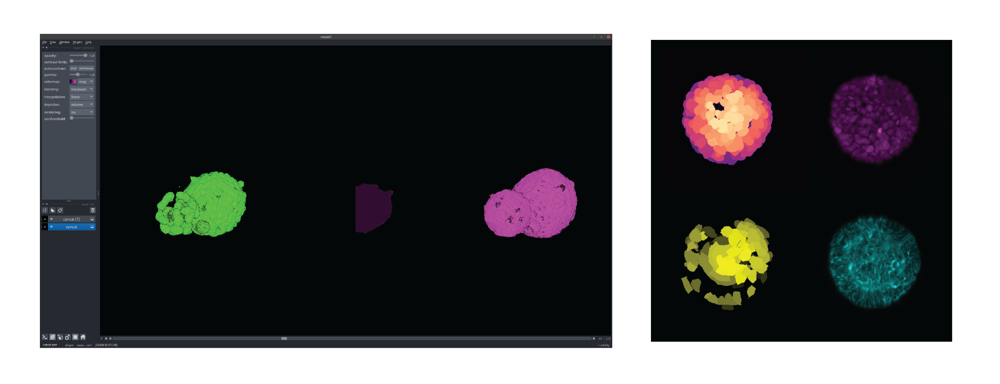

  

---

\* Corresponding authors: josh@openmicroscopy.org, norman.rzepka@scalableminds.com, christian.tischer@embl.de, ulman@fi.muni.cz, virginie.uhlmann@mls.uzh.ch

---

# 1. Introduction

The past years have seen growing community interest in the standardization of open and findable, accessible, interoperable, and reusable (FAIR)[@wilkinson_fair_2016] image data formats for bioimaging. A key effort in this space is the next generation file format OME-Zarr [@moore_ome-ngff_2021]. Since its first activities in 2018, the international OME-Zarr community has grown considerably and scientists from all over the world have been contributing to the file format specification, adding support to image viewers and building tooling around OME-Zarr [@moore_ome-zarr_2023]. The OME-Zarr format combines a general-purpose data format for storing large n-dimensional arrays ([Zarr](https://zarr.dev/)) with a community-defined specification for bioimage metadata representation (Next Generation File Format, NGFF). Building upon the chunked Zarr data format, OME-Zarr has specifically been designed for the storage and analysis of large bioimaging datasets in the cloud (i.e. object storage). In 2023, we organised a first [“Next generation bioimage analysis workflows hackathon”](https://www.biovisioncenter.uzh.ch/en/events/2023/hackathon_23.html) that aimed at bringing the OME-Zarr community together both to move forward on the file format specification and to implement essential supporting resources. Given the [success of this event](https://forum.image.sc/t/outcomes-of-the-next-generation-bioimage-analysis-workflows-hackathon/88733), we decided to organize an [“OME-NGFF Workflows Hackathon at the end of 2024”](https://www.ema.uzh.ch/en/register/ome-ngff-workflows-hackathon-2024.html).  

The 2024 OME-NGFF Workflows Hackathon was focused on 4 main topics (see Figure 1):  

- **The OME-Zarr specification**, which aimed at working on the specification itself as well as clarifying the process of how the community contributes changes to the current specification. We specifically discussed the new request for comment (RFC) process, storing OME-Zarr data in individual ZIP files, collections, and transformations.  
- **The usage of OME-Zarr in workflows**, which explored how to develop interoperable OME-Zarr processing units and how to compose them into reusable workflows.  
- **OME-Zarr in the Java ecosystem**, which worked on incorporating support for [Zarr v3](https://zarr-specs.readthedocs.io/en/latest/v3/core/v3.0.html) in Java Zarr libraries and on making it possible to open OME-Zarr images in the popular Java-based image analysis software Fiji [@schindelin_fiji_2012].  
- **OME-Zarr in the Python ecosystem**, which focused on compiling an overview of available Python tools for OME-Zarr handling, finding ways to collaborate on shared libraries, testing the performance of processing workflows using OME-Zarrs depending on chunking and sharding configurations, and working on representing transformations in Xarray[@hoyer_xarray_2017].  

In this report, we provide a detailed account of the outcome of the hackathon. Throughout the manuscript, we use ‘OME-Zarr’ to designate the shared file format for bioimage data, ‘NGFF’ to designate the process to agree on the specification for OME-Zarr, and ‘Zarr’ to refer to the underlying API and storage solution behind OME-Zarr.

# 2. Results
## 2.1 The core OME-Zarr specification
### 2.1.1 Introduction to Zarr
The OME-Zarr specification is raising interest for the underlying [Zarr](https://zarr.dev/) file format among bioimaging scientists, as illustrated by the large number of participants in the 2024 hackathon. Several of the attendees were new to Zarr and were seeking to use the event as an opportunity to acquire foundational knowledge of how Zarr works, so as to be prepared to get the most out of this file format.  

Recognizing this, an optional “Zarr for beginners” session was spontaneously organized by more seasoned participants on the first day. Attendees were given an introduction on Zarr, including the history of the file format, how it works, and the key differences between Zarr version 2 and the new version 3. Giving all participants the necessary background on Zarr ensured that everyone could effectively contribute to the hackathon. We hereafter summarize this Zarr primer that may be of broader interest.  

**What is Zarr?**  
The two following premises can help bioimaging scientists understand the Zarr file format: first, Zarr is not really a file format, and second, it has originally nothing to do with microscopy data. Zarr has major conceptual differences with file formats conventionally used in bioimaging such as TIFF. Conventional bioimaging file formats are constructed on the assumption that an image is entirely saved into a single file, where different parts of the image are saved in different parts of the file. Zarr is specified differently: instead of describing the internal structure of a single file, the Zarr specifications describe a generic storage protocol, or application programming interface (API), that data producers and data consumers [@uhlmann_making_2024] can use to represent collections of N-dimensional arrays broken up into individually addressable pieces. The most common Zarr implementation uses collections of files and folders on the local file system to represent a single N-dimensional array that, in bioimaging applications, contains the image. The same Zarr array could also be stored without files at all in a memory storage backend or as a single zip file, as discussed further in section 2.2.3. When talking about Zarr as a “file format”, we are therefore actually describing a protocol for handling collections of “stored objects”. Although these stored objects are typically files, they don’t have to be. The Zarr format might be simpler to understand than conventional file formats such as TIFF once getting past the change in abstraction levels, switching from the internal structure of a single file to collections of objects.  

**The history of Zarr**  
Zarr was created by [Alistair Miles](https://orcid.org/0000-0001-9018-4680). who wrote specification documents for a [version 1](https://github.com/zarr-developers/zarr-specs/blob/main/docs/v1/v1.0.rst) and later a [version 2](https://github.com/zarr-developers/zarr-specs/blob/main/docs/v2/v2.0.rst) while developing a Python implementation of the Zarr format. Zarr version 2 and its Python implementation then became widely used across the Python data science ecosystem as a lightweight tool for storing collections of arrays.  

**The Zarr data model**  
Zarr defines two core entities: arrays and groups (see Figure 2). Zarr arrays model N-dimensional grids of homogeneous elements. They have attributes such as “shape” (a collection of numbers defining the size of the data) and “data type” (a definition for what the elements of the array are, e.g. integers or floating point numbers). Zarr arrays are broken up into separate objects called chunks, where each chunk is a sub-region of the array. Breaking the array into small pieces means that typical bioimaging queries such as loading the last slice of an image stack can be translated into reading a small amount of the total data, which allows these queries to be fast and efficient. This is usually referred to as “lazy loading” or “on-demand partial loading”. Groups are much simpler than arrays and give Zarr its ability to define hierarchies. Conceptually, groups are like folders that can contain arrays or other groups. It is typical for a Zarr user to arrange their data in a tree, where multiple arrays are contained in potentially multiple groups.  

In keeping with the ethos of simplicity, both arrays and groups are defined by a JSON-formatted metadata document [@pezoa_foundations_2016]. Folders on the local file system containing a Zarr array metadata document are then referred to as a Zarr array. As metadata are stored in JSON documents, they are human readable and make the internals of the format accessible to lay inspection. Zarr arrays and groups can be associated with arbitrary, potentially unstructured metadata, termed “attributes”. The only requirement for these attributes is that they must be stored as JSON, like the metadata documents themselves. The free-form nature of the “attributes” field provides a place for users, or communities of users, to define metadata that gives meaning or context to a Zarr dataset. For example, OME-Zarr uses a combination of special fields in the “attributes” of Zarr groups, as well as a particular arrangement of Zarr arrays, to define its data model.  

![Organisation of chunked data and json metadata in a typical OME-Zarr 0.4, based on Zarr V2 (figure adapted from original work by Trevor Manz [@manz_reading_2025])](figures/figure2.png){ width=80% }

This introductory session revealed that, although the Zarr format might be composed of simple parts (“just” collections of stored objects), it has grown into an ecosystem with a substantial social, historical, and technical context. Understanding this context is vital for current and potential OME-Zarr users to make informed decisions about the format. **For this reason, we believe that developing and publishing user-focused educational materials would be an excellent investment for both the Zarr and OME-Zarr projects.** Ideally, everyone attending future hackathons would have access to such materials ahead of time, rendering such an extensive “Zarr for beginners” session unnecessary.  

As a first contribution to improved documentation, we compiled an up-to-date survey of tools available to create and work with OME-Zarr data. We submitted it as a [PR to update the tools documentation page](https://github.com/ome/ngff/pull/273), which has led to [an updated tools page with a table layout](https://ngff.openmicroscopy.org/tools/index.html).

### 2.1.2 The NGFF RFC process
The next-generation file formats (NGFF) process is an effort to specify and standardize a modern, scalable and interoperable file format for bioimage data. The NGFF specification (hereafter referred to as “spec” for short) has led to the creation of the OME-Zarr format. We began the hackathon with an overview of the recent addition to the NGFF process of the [Request for Comment (RFC) process](https://doi.org/10.5281/zenodo.14505620) outlined in [RFC-1](https://ngff.openmicroscopy.org/rfc/1/). It highlighted the history of the OME-Zarr file format development as well as the challenges of defining common representations for the metadata required in bioimaging (e.g., storing pixel sizes in a common format). **The RFC process was introduced in 2024 to streamline decision-making in a growing community.**  

Discussions explored ways to lower the barrier to proposing RFCs. Notable suggestions included providing an RFC pull request template and dedicating time to writing up RFCs together at future hackathons. An important discussion point focused on the definition of the scope of RFCs, and on the guiding principles deciding between a topic being proposed as an RFC or as a GitHub pull request (PR). We agreed that any change to the spec that would require changes in any implementation (i.e. software that reads or writes OME-Zarr) should become an RFC. In contrast, minor fixes without implementation implications should still be submitted as Github Issues and Pull requests (PRs) and will be reviewed by the OME-Zarr editor(s), currently Josh Moore as defined in RFC-1. Minor PRs turning into broader required changes would then trigger the editors to highlight the need for an RFC.  

### 2.1.3 OME-Zarr 0.5 release
Following the accepted proposal put forward in [RFC-2](https://ngff.openmicroscopy.org/rfc/2/index.html) to adopt Zarr version 3, **OME-Zarr 0.5 was released. All data written in OME-Zarr 0.5 must be written in the Zarr v3 format and can optionally enable sharding.** Sharding enables the aggregation of many small chunks into larger individual files called ‘shards’, reducing file system overhead while maintaining efficient random access to small data volumes (see Figure 3), which is critical for applications like interactive visualization. Another performance advantage of sharding is improved caching efficiency. By grouping small files into larger shards, one can take advantage of read-ahead caching mechanisms built into storage and operating systems. Specifically, if adjacent chunks are stored together, sequential access benefits from more efficient data retrieval. Various efforts at the hackathon, including the work on Java support (see section 2.4.1) and on benchmarking performance implications of sharing (see section 2.5.3), aimed to expand support for the Zarr v3 format across the entire ecosystem.  

![OME-Zarr 0.5 using the Zarr v3 format. (Figure adapted from original work by Trevor Manz [@manz_reading_2025]))](figures/figure3.png){ width=80% }

Besides supporting sharding, existing implementations will also need to be updated to place all OME-Zarr metadata under the top-level “ome” key within the Zarr metadata. This unifies all of the metadata used for OME-Zarr under one key, allowing users to store their own metadata alongside the OME-Zarr metadata without worrying about potential name collisions. The full spec can be found at https://ngff.openmicroscopy.org/0.5/.  

## 2.2 Additions to the OME-Zarr specification
### 2.2.1 Coordinate transformation support for visualization
The upcoming specification for coordinate systems and transformations described in RFC-5 will give researchers using OME-Zarr the flexibility to express transformations necessary for tasks such as longitudinal studies, multi-modal correlative imaging, and comparative analysis across different subjects or experimental conditions. As many different kinds of transformations can be defined, we found that not all viewers would be able to support every type of transformation. **We thus discussed distinguishing between “basic” and “advanced” transformations. To achieve interoperability, visualization tools would need to consistently support the “basic” transformations.** Toward that end, our goals were to:  
	
- Decide what the core transformations should be;  
- Determine pain points for current visualization tools and strategies to address them;  
- Coordinate how “collections” (see section 2.2.2) would interact with coordinate systems.  

Some types of transformations are simpler and more “fundamental” (“basic”) than others. The specification should make this clear to implementers of visualization tools and data producers so that most data stored in the OME-Zarr format can be displayed consistently across most visualization tools. Of course, the use-cases that require more complex (“advanced”) transformations should have the flexibility to use them when necessary.  

**The hackathon achievements in the coordinate transformation group also included extensive work on representing transformations in Xarray (see section 2.5.2), direct feedback on [RFC-5](https://github.com/ome/ngff/pull/255), and the addition of [new user stories](https://github.com/ome/ngff/issues/84#issuecomment-2493389823) to help guide future directions.**

### 2.2.2 Collections
A new RFC was discussed to define a mechanism for storing collections of images with OME-Zarr. These collections could be used, for example, to group images that are co-registered in the same coordinate space. They could include microscopy images as well as derived images, such as segmentation and prediction maps. It could also be used for other types of image collections, such as high-content screening or image archives [@williams_image_2017][@hartley_bioimage_2022][@iudin_empiar_2016]. Discussions highlighted that an important design aspect is that images may have additional metadata attached that is only applied within the context of a specific collection. For example, in correlative microscopy, transformation (registration) metadata depends on which images should be visualised together. A major motivation for introducing collections is to support visualization tools that frequently want to visualize multiple images at once. We therefore concluded that it would be convenient for users to be able to point to a single URL that defines the group of images and attached metadata for its visualization. Other motivations are extensibility, discoverability, metadata attachment, data federation and data reuse.  

**As an outcome of the hackathon, a group of attendees has formed a working group to draft an RFC about “collections” to be discussed with the wider OME-Zarr community. Anyone interested to contribute to this RFC is invited to reach out to the corresponding authors of this article.**

### 2.2.3 Single-file (“ZIP”) OME-Zarr
For OME-Zarr to become a truly unifying file format across a broad range of bioimaging modalities, it must also serve the use-case of smaller datasets stored on “traditional” (i.e. local) file systems. While the OME-Zarr format can be used for small images, it is arguably not always convenient to use at this point. Facilitating the compliance of locally stored datasets with OME-Zarr would make OME-Zarr-enabled computational tooling available more broadly and would enable small datasets to benefit from features that are unique to OME-Zarr (e.g. coordinate transformations, high-content screening specifications).

One key factor that hampers the adoption of OME-Zarr for local datasets is presumably the organization of data in a nested directory structure with many files (chunks) rather than a single file. Splitting an image across many small files can be inefficient with modern file systems, users may prefer the simplicity of a single file container over a nested folder, and developers of existing file-based bioimage analysis software may find it easier to add support for another file type rather than implementing the handling of (nested) file system directories (e.g. for drag-and-drop support). While the first issue (many small files) can be alleviated by the sharding feature introduced with Zarr v3 (see section 2.1.3), the other, usability-related issues remain.  

Discussions revolved around how to best achieve the goals of OME-Zarr with single files. In principle, a solution could consist of combining the NGFF specification with a general-purpose data format for storing n-dimensional arrays in a single file (e.g. HDF5) instead of Zarr. However, this approach would result in the creation of yet another competing bioimage file format ("OME-HDF5") and would fragment the NGFF community. Instead, one could store existing OME-Zarr data "as is" in a single archive (e.g. ZIP) file. This is already done in routine practice and supported by several available OME-Zarr implementations (Table 1). In fact, storing Zarr-encoded data in a single archive file is not restricted to the OME-Zarr use case, and [work is under way towards formalizing a "ZipStore" in the upstream Zarr specification](https://github.com/zarr-developers/zarr-specs/pull/311).

| Zarr reader   | Programming language | Single archive file support | Relevant OME-Zarr implementations |
|--------------|----------------------|-----------------------------|----------------------------------|
| zarr-python | Python               | Yes, using ZipStore (Zarr v2) or fsspec path chaining | Zarr backend for ome-zarr-py, bioio, aicsimageio, xarray |
| Zarrita.js  | Javascript           | Yes, using ZipFileStore      | - |
| zarrs       | Rust                 | Yes, using ZipStorageAdapter (zarrs_zip crate) | - |
| Zarr.jl     | Julia                | Yes, using ZipStore          | - |
| Tensorstore | C++ / Python         | Potentially, using Key-Value Store driver | - |
| JZarr       | Java                 | Planned                      | Zarr backend for OMEZarrReader, Bio-Formats |
| n5-zarr     | Java                 | No                            | - |
| GDAL        | C++ and others       | No                            | - |
| Zarr.js     | Javascript           | No                            | - |
| Pizzarr     | R                    | No                            | - |
| Rarr        | R                    | No                            | - |

**Table 1:** Surveyed Zarr implementations and their capabilities to read single archive files.
  
To ensure file format compatibility in practice, both the archive file format and the detection of OME-Zarr within an archive file need to be specified. We quickly concluded that ZIP should be the archive file format of choice due to its widespread adoption and support (including most operating systems), and its use of a "central directory file header" (CDFH; beneficial for remote access, e.g. when using HTTP range requests). Drawbacks of ZIP (e.g. low compression ratios, depending on the codec) can mostly be alleviated by OME-Zarr features (e.g. Zarr compression), with the exception of support for efficiently appending/deleting archive file contents, though this may not pose a significant concern for small datasets. **We recommend that ZIP-enabled OME-Zarr writers create uncompressed ZIP64 files (to enable in-place editing), and that ZIP-enabled OME-Zarr readers may additionally support reading ZIP64 files compressed with commonly used compression codecs (e.g. to support ZIP archives that were not generated with OME-Zarr-specific tooling).**  

When accessing OME-Zarr data within a ZIP file, defining the Zarr root relative to the ZIP root is a key configuration that has been the subject of several discussions. **We propose to define the ZIP root as the Zarr root (i.e. with the Zarr root-level ``zarr.json`` file being placed in the ZIP root).**  

Working towards a canonical specification of how to store OME-Zarr data within a single file, we summarized our findings and more detailed analysis in a [comment on the existing “ZipStore” draft for the Zarr specification](https://github.com/zarr-developers/zarr-specs/pull/311#issuecomment-2498071484). Given that our deliberations were not restricted to the OME-Zarr use case, we believe that the Zarr specification would be the right place to make the necessary additions. Going forward, however, we could also envision focusing solely on OME-Zarr, by submitting an RFC.  

## 2.3 OME-Zarr workflows
We wanted to address the challenge of interoperability among image processing and analysis workflow tasks (processing units of a workflow). The standardization of image file formats with OME-Zarr brings great potential to increase the interoperability of complex workflows. In the OME-Zarr workflows discussions, we tackled the question of how such workflow tasks need to be structured so that they are usable across different frameworks.

### 2.3.1 Landscape of workflow orchestration frameworks
We examined how workflows are executed in frameworks such as [Fractal](https://fractal-analytics-platform.github.io/), Nextflow [@di_tommaso_nextflow_2017], Snakemake [@koster_snakemakescalable_2012], [Dask](http://dask.pydata.org) and napari [@sofroniew_napari_2025]. Fractal is a framework specifically designed to manage and process workflows using OME-Zarr data which provides a web interface to workflow building and an API for OME-Zarr processing tasks. Nextflow is an orchestration framework used broadly to automate computational workflows with growing usage in bioimage analysis. It enables scalable, containerized workflows to run reproducibly. The Snakemake workflow engine is another popular tool widely used to automate multi-step bioinformatics tasks. It provides a Python-like rule-based syntax to facilitate the design of pipelines and supports configuration files in both the JSON and YAML formats. Dask enables building complex computational graphs and executing parallel processing workflows locally or on a cluster via its approachable Python interface. Napari is a Python-based image viewer that, through its plugin interface, is often used to run interactive processing steps via napari-native workflow implementations such as the [napari assistant](https://github.com/haesleinhuepf/napari-assistant) [@robert_haase_haesleinhuepfnapari-assistant_2023] or [napari-skimage](https://www.napari-hub.org/plugins/napari-skimage). A commonality was that, for bioimage analysis, **many of these frameworks define a linear graph of processing steps (e.g., for image processing, segmentation, or quantification) that is easy to parallelize over individual images. The model of workflow tasks going from on-disk OME-Zarr to on-disk OME-Zarr appears as a promising interoperability unit.** In this model, implemented in Fractal, each task takes an OME-Zarr uniform resource identifier (URI, a file path or URL) and additional task specific parameters as an input and stores the results (output) of its processing back into an OME-Zarr container (Figure 4).

### 2.3.2 Implementation and evaluation strategies
Given that the Fractal framework already provides its [tasks in a general format with a json specification](https://fractal-analytics-platform.github.io/tasks_spec/) for the required inputs, we decided to use the [Fractal task template](https://github.com/fractal-analytics-platform/fractal-tasks-template) as a starting point for this hackathon. Interestingly, nf-core (a specification for Nextflow workflows) also uses a JSON schema to define module inputs; thus, a future aim could be to provide Fractal tasks as nf-core modules. This template package provided an example of a simple thresholding task that creates a label segmentation based on an input intensity image [@luthi_ome-zarr_2024] and we worked on running workflows in Fractal, Nextflow, snakemake and napari based on this shared task code (Table 2).

| Framework  | Hackathon Repository  | Implementation strategy  | Open questions  |
|------------|----------------------|--------------------------|-----------------|
| **Fractal** | [Fractal task template](https://github.com/fractal-analytics-platform/fractal-tasks-template) | Set up a full local Fractal setup using the full-stack example in [Fractal containers](https://github.com/fractal-analytics-platform/fractal-containers). Run tasks as a Fractal workflow. | - |
| **Nextflow** | [nf-core compatible Nextflow workflow for Fractal tasks](https://github.com/cellgeni/nf-fractal-demo) | Containerize Fractal tasks using Docker/Singularity containers. Encode input parameters into a JSON file. Directly provide parameters using Nextflow-native configurations. | Handling task output JSON files. |
| **Snakemake** | [Snakemake wrapper for the thresholding task](https://github.com/d-goryslavets/snakemake-thresholding), [napari plugin for Snakemake workflow](https://github.com/d-goryslavets/snakemake-thresholding-napari-plugin) | Create a Snakemake wrapper for Fractal OME-Zarr tasks. Use Conda for environment handling. Pass in parameters via a YAML file. Add a napari GUI to interactively run the task and explore the results. | - |
| **napari** | [napari plugin prototype](https://github.com/krentzd/napari-workflow-tasks/) | Access on-disk OME-Zarr based on metadata added to the viewer by the napari-ome-zarr plugin. Run processing in the background. Load results back. | Knowing the expected task output to display. [Handling the environments in which the tasks are installed and run](https://github.com/krentzd/napari-workflow-tasks/issues/1). |

**Table 2:** Summary of the outcomes of implementing the image thresholding task in different workflow systems.  

We were able to run the Fractal OME-Zarr thresholding task in all 4 settings without having to modify the task code (see Figure 5). In addition to the thresholding task, we also implemented a wrapper for running cellpose [@pachitariu_cellpose_2022] on OME-Zarr data in Nextflow using the [existing Fractal cellpose task](https://github.com/fractal-analytics-platform/fractal-tasks-core/blob/main/fractal_tasks_core/tasks/cellpose_segmentation.py). To run Fractal tasks in napari, we developed a PyQt plugin that allows users to directly import tasks from any Fractal manifest file (also tested with the Cellpose task above). Task parameters and executable paths are directly obtained from this manifest file and interactive GUI fields are dynamically created. This allows users to interactively explore parameter settings, in some cases in near real–time. Crucially, tasks are executed as subprocesses and results are directly written to the selected OME-Zarr file which are then displayed to the user in the napari viewer. The plugin thus conforms to the “disk to disk” schema and can in principle execute any type of task operation in the background. 

### 2.3.3 Challenges and opportunities for future developments
The Fractal OME-Zarr task approach was found to offer a promising framework, especially to encapsulate more complex processing needs such as out-of-core analysis and to enable scalable workflows. The “from disk to disk” schema enables running tasks defined in this way in many workflow engines that are fundamentally different. **The main areas for future improvements that we found were the specification of output metadata schemas, subset selection in tasks and environment management and containerization.**  

- *Specification of output metadata schema:* The current Fractal task JSON specification doesn’t provide defined schemas to specify the output that tasks produce when it is saved back into the same OME-Zarr container (e.g., adding labels or measurements to an existing OME-Zarr). It only provides an output schema specification for new OME-Zarr data that get created by a task or to provide additional metadata for the existing OME-Zarr data. Some applications such as the napari plugin to run Fractal OME-Zarr tasks would benefit from additional output metadata, which would also enable easier validation of whether workflows are chained correctly. In Nextflow workflows, a tighter integration of outputs would be necessary to avoid creating duplicate output files. Thus, further developments of the Fractal OME-Zarr task output specification is warranted.  
- *Subset selection in tasks:* Standardized controls over the selection of task subsets would be very valuable to enable different workflow managers to use Fractal OME-Zarr tasks in a deployment-optimized manner. Fractal OME-Zarr tasks allow parallelizing easily and in custom manners over the selection of all OME-Zarr images. More flexible subset selections (e.g., selecting individual timepoints, parallelizing over channels or only processing a subset of the regions of interest) would need further work to handle the complexity of potentially multiple processes writing to the same OME-Zarr file.  
- *Environment management and containerization:* In the context of running tasks in a viewer like napari, the need to install all dependencies within the same environment as napari is a limitation which could pose problems with dependency conflicts. Future efforts should therefore be focused on developing a framework where tasks are executed in their own environment or as containers even when used in a napari plugin. One promising avenue in this context could be the use of environment managers like [pixi](https://pixi.sh/latest/) that can set up environments on-the-fly. An alternative direction would be a standard for containerized tasks that can then be run in frameworks like Nextflow as well as in a napari plugin configuration.  

**Overall, the hackathon has shown the potential for standardized OME-Zarr tasks to enable interoperable image processing and the need for further community collaboration in defining specific standards for such tasks.**

## 2.4 OME-Zarr Java ecosystem
The goal of the OME-Zarr Java ecosystem group was to be able to open an existing Zarr v3, and consequently OME-Zarr v0.5, dataset from [the Fiji image viewer](https://imagej.net/software/fiji/) [@schindelin_fiji_2012].

### 2.4.1 Java support for Zarr v3
Discussions started with an update on the current state of work on this topic, which is mainly to be found [on the n5-zarr](https://github.com/saalfeldlab/n5-zarr/tree/wip/codecsShards) and [zarr-java](https://github.com/zarr-developers/zarr-java) repositories. Some existing Zarr v3 implementations (in particular webknossos [@boergens_webknossos_2017]) already handle reading and writing of chunks and shards and were identified as a good starting point to prioritize the Java work. Upon common agreement, participants decided to focus hacking on data reading as opposed to data writing.  

Zarr v3 metadata parsing and reading individual chunks from a shard appeared to be necessary features that were mostly complete and functional at the start of the hackathon. There were however also missing necessary features: the Zarr codebase in Fiji was not able to open Zarr v3 as it was failing to detect the correct data format from a provided URL. Additionally, the Zarr v3 readers did not correctly parse certain metadata. **We therefore improved group and array recognition from metadata and worked on Zarr v3 compression classes.** In particular, we 
updated [OME-Zarr metadata parsers in Java to work with RFC-2](https://github.com/saalfeldlab/n5-universe/pull/29). We worked on a [blosc codec serialization](https://github.com/saalfeldlab/n5-blosc/pull/10), added [Zstandard compression](https://github.com/saalfeldlab/n5-zarr/pull/54) with [unit tests](https://github.com/saalfeldlab/n5-zarr/pull/55) to Metadata reader/writer class ZarrV3Compressor, and updated the Zarr v3 attribute API correspondingly.  

For developers' convenience during and beyond the hackathon, an ImageJ Starter was added to the [n5-universe code base](https://github.com/saalfeldlab/n5-universe/pull/28), allowing ImageJ to be started directly from development environments with n5 plugins available immediately. This new tool also makes debugging easier.

### 2.4.2 Opening OME-Zarrs in Fiji
A core benefit of Fiji is the ease-of-use when opening images saved in different formats. To ensure OME-Zarrs are easy to use in Fiji, we [continued work to enable drag-and-drop](https://events.it4i.cz/event/145/) functionality for OME-Zarr in Fiji. The [new solution](https://github.com/BioImageTools/ome-zarr-fiji-java) we produced is entirely based on the n5-universe, and opens the N5 Importer dialog when an OME-Zarr is dropped into Fiji. For that, we had to introduce some minor, mostly technical improvements of the [DatasetSelectorDialog API](https://github.com/saalfeldlab/n5-ij/pull/96). Some changes were purely implemented for user convenience. For instance, if an OME-Zarr nested folder is dropped into Fiji, the N5 Importer dialog (which browses the OME-Zarr) starts with the already selected nested folder (see Figure 6). The solution can also directly open the BigDataViewer (BDV) if the ALT key is held during the drag-and-drop event. However, the way BDV is currently started does not utilize the Zarr’s pyramids if they are present. These changes will be making their way through the Fiji toolchain and become widely available in the near future. To test them already, the updated n5-ij.jar and ome-zarr-fiji-ui.jar are available from https://sites.imagej.net/xulman/, which is an open, not-listed (due to its experimental content) Fiji update site.

{ width=70% }

**To integrate further OME-Zarr support into Fiji’s existing workflows, we envision a suite of SciJava plugins designed to enable standard Fiji pipelines (macros, Jython scripts, and GUI-based plugins) to interact with Zarr datasets.** Inspired by the [HPC DataStore project](https://github.com/fiji-hpc/hpc-datastore/), we are going to develop standard Fiji plugins, one for each functionality. For example, one plugin to query, another plugin to read, and yet another plugin to write Zarr data. This should enable common tasks like retrieving metadata, accessing specific images, or processing image series in loops in Fiji because the plugins will be accessible through Fiji’s GUI, will be macro-recordable, and thus usable in scripting workflows, ensuring seamless adoption across user workflows. At the core of this implementation would be an NgffService, a [SciJava](https://scijava.org/) service that manages caching and optimizes repeated queries to Zarr datasets. This service would act as a central access point for said plugins, ensuring efficient data handling. The project would include a public Java API and initially use the N5 library for implementation, and **the first version of it is to be expected in 2025.**

## 2.5 OME-Zarr Python ecosystem
### 2.5.1 Reducing Python Tooling Duplication
Despite the growing adoption and popularity of the OME-Zarr file format, the Python tooling landscape for working with OME-Zarr data remains fragmented. Multiple libraries currently exist, each offering differing approaches to reading, writing, and validating metadata and image data, as well as to extending or customizing the specification.  

This diversity has introduced unnecessary complexity, duplication of effort, and confusion - particularly for developers and users who are new to OME-Zarr. Over the course of the hackathon, we came together to confront this issue. We recognized that a fractured tooling landscape is neither efficient nor sustainable. It places an undue burden on both software maintainers and end-users. Multiple codebases often re-implement the same core functionality, while users must navigate an array of APIs and patterns with inconsistent documentation or compatibility. These challenges not only slow down new adopters but also impede the long-term sustainability and growth of the OME-Zarr ecosystem.  

The reasons behind the current fragmentation are diverse. In some cases, multiple teams developed their own OME-Zarr readers and writers to satisfy immediate project-specific needs, often in isolation. In others, the evolving OME-Zarr specification and lack of a clearly defined reference implementation prompted parallel development efforts. Whatever the cause, we reached the consensus that no single existing library currently meets the full spectrum of community needs.  

To address this, we identified a minimal set of core requirements that a foundational Python OME-Zarr library should fulfill. These include the ability to validate OME-Zarr metadata against the specification, a simple and intuitive Pythonic API, minimal external dependencies to ease integration, and mechanisms to extend and customize behavior.  

With these common goals in mind, the discussions culminated in the foundation of a new library: [ome-zarr-models-py](https://github.com/ome-zarr-models/ome-zarr-models-py). Acknowledging that creating yet another tool may seem like a counter-productive solution to a problem caused by too many tools, we coordinated with the authors of some of the existing tools, many of whom were present in the discussion, to ensure that our effort would actually reduce fragmentation. The majority of the participants expressed interest in deprecating their own solutions in favor of a centralized, community driven strategy. **The ome-zarr-models-py project seeks to provide these fundamental capabilities, serving as a stable and extensible substrate upon which the broader community can build specialized tools, high-level user interfaces, and advanced functionalities. By consolidating efforts around ome-zarr-models-py, we aim to foster a more cohesive Python ecosystem for OME-Zarr, ensuring that future evolution of the specifications can take root more smoothly.** Since the workshop, full support for OME-Zarr 0.4 has been added to ome-zarr-models-py and a first release was made. Work is underway to support OME-Zarr 0.5.  

### 2.5.2 Representing OME-Zarr Images with RFC-5 transforms in Xarray
Numpy-like arrays are the core data structure of array-based scientific computing workflows in Python [@harris_array_2020]. The Xarray package provides wrappers around NumPy arrays that use labeled dimensions and coordinates, as well as further attributes, to support metadata aware operations.5 Considering their interoperability and popularity in the scientific Python community, [including for biological images](https://github.com/napari/napari/issues/14), Xarray objects are a natural and convenient choice for working with OME-Zarr images in Python. Specifically, multiscale OME-Zarr images can be represented in Xarray [using Xarray.DataTree objects] (github.com/spatial-image/multiscale-spatial-image), which reference Xarray.DataArray objects for each resolution level. In OME-Zarr version 0.4, "coordinateTransformations" metadata containing identity, translation and scale transformations, can be represented as Xarray coordinates in a straightforward manner. However, more complex metadata introduced by [RFC-5](https://ngff.openmicroscopy.org/rfc/5/index.html), such as coordinate systems and more complex transformations (notably affine transformations), cannot easily be represented in Xarray coordinates.  

We therefore discussed the three following solutions for conveniently including new transformation metadata proposed in RFC-5 in Xarray.DataArray objects:

1. *Use Xarray coordinates for scale and transformation and perform further transformations that cannot be represented on an orthogonal coordinate grid on the image data on the fly, then mask the resulting data arrays to exclude regions that are not part of the image.* This solution would be straightforward in the sense that all image and transform data would be encoded in the resulting in-memory Xarray objects and therefore directly compatible with all Xarray methods/functionality. However, data would need to be resampled, which would include an interpolation step. Also, data would contain invalid (masked) points after resampling, that would need to be handled downstream. Finally, transforming data on the fly would certainly be computationally expensive.  
2. *Use multidimensional axis coordinates to represent complex transformations.* This would be a very explicit way to represent complex transformations, in which coordinate arrays could represent a significant data overhead. This could in part be mitigated by using dask arrays as coordinate arrays. A potential downside would be that the required Xarray coordinate transformation features might take time before reaching stability (see [the Xarray proposal on flexible index refactoring](https://github.com/pydata/xarray/blob/main/design_notes/flexible_indexes_notes.md)).  
3. *Store all or a subset of transformations in the Xarray attributes.* This solution would require attaching a meaning to the Xarray attributes and would be less explicit than solutions 1 and 2. However, no data interpolation would be required and multiple coordinate systems could easily be represented by different attribute keys. Additionally, a variant of this solution could restrict the attributes to contain only non-orthogonal transformations (similar to solution 1), while scale and translation would be represented in Xarray coordinates. This would account for the fact that array coordinates would be modified during Xarray operations and would be more comparable to the napari model of data, physical and world coordinates.  

As a result, examples of the three implementations have been implemented in [a Jupyter notebook](https://github.com/BioImageTools/ngff-transformations/blob/main/xarray_representations_examples.ipynb). Participants saw use cases for all three solutions, but had preferences for solutions 1 and 3. Solution 1 was favored for the provision of pre-transformed and ready-to-use image data and straight-forward compatibility with Xarray methods. The latter was favored for its capability to provide good Xarray compatibility, to avoid the need for data interpolation and for the flexibility it offers in defining multiple coordinate systems. Existing implementations of solution 3 include an extension of github.com/spatial-image/spatial-image within github.com/scverse/spatialdata and the [Xarray.DataArray - itk.Image converter](https://github.com/InsightSoftwareConsortium/ITKPythonPackage) [@mccormick_itk_2014].  

Additionally, the SpatialData library [@marconato_spatialdata_2025] developed a number of classes that have made working with transforms in-memory (i.e., after they’ve been read from the OME-Zarr) more ergonomic. We discussed a plan to extract the code from the SpatialData codebase and reformat it into two more general packages consumable by the bioimaging community. One package (ome-zarr-models-py, see section 2.5.1), would contain classes to parse and validate the coordinate transformations metadata, thus implementing an in-memory interface for the OME-Zarr on-disk specification. The second package would implement ergonomic operations to create, compose, subset, and apply the various coordinate transformations, and to import them and convert them from and to common formats (e.g. ITK, matplotlib). This second package would also implement a bridge between the Xarray coordinate-based representation and the corresponding coordinate transformations, thus increasing the interoperability between on-disk representation and ergonomic in-memory operations.  

These efforts aim to bridge the gap between the OME-Zarr metadata specification and practical in-memory transformations, ensuring both compatibility with existing tools and efficiency in scientific workflows. Our discussions highlighted a preference for using Xarray attributes to store complex transformations due to its flexibility, avoidance of data interpolation, and strong compatibility with Xarray operations. Additionally, the use of Xarray coordinates for scale and translation was favored for its straightforward compatibility with Xarray methods and provision of pre-transformed image data. **By modularizing transformation handling into dedicated libraries, we plan to provide a flexible and scalable approach for working with OME-Zarr metadata in Xarray-based environments, while also improving interoperability with external imaging frameworks.** Future work will focus on refining these implementations, gathering community feedback, and integrating these approaches into widely used bioimage analysis pipelines to facilitate broader adoption.

### 2.5.3 Benchmarking OME-Zarr Chunking & Sharding 
We sought to understand how different parameter choices impact real-world performance when working with large datasets. A first group investigated efficient parallel processing of chunked file formats to handle larger-than-memory arrays. While these formats enable lazy and distributed processing, achieving optimal performance requires aligning chunking schemes with the workflow’s requirements. Factors such as chunk shape, block-wise execution and data access patterns significantly influence performance and memory management. A second group investigated concerns originating in the connectomics community, where datasets often reach petabyte scales. Connectomics datasets, primarily read-only, are stored across various filesystems – from high-performance enterprise storage in early stages to high-latency, cost-efficient cloud storage. Thus, benchmarking the performance implication of sharding (see section 2.1.3) was set as a key goal.  
 	
To address the challenges of large-than-memory computing, we applied a simple segmentation task to a real-world bioimaging dataset consisting of a light sheet microscopy image collection. The collection was composed of multiple TIFF files, where each file represented a single 3D volume ((279, 4, 91, 554, 928) dimensions corresponding to time, channel, z, y, and x, for a total size of ~50 GB), together constituting a 4-channel volumetric time-series image (see figure Figure 7). The test data is available on zenodo [@moos_light_2025]. Splitting a large image into a collection of TIFF files in this way is commonly done in bioimaging for easier data handling. Relying on this dataset, our goal was to identify good practices in terms of performance and memory management.  

Our workflow consisted of three primary steps. First, TIFF files were read and concatenated along the time and channel dimensions into a single Dask array. The resulting Dask array was chunked along the time and channel dimensions, with each chunk corresponding to a single 3D volume (zyx). Second, Otsu thresholding, as implemented in Dask, was applied to the dataset in a chunk-wise manner. A chunk-wise parallelisation appeared to be appropriate in this scenario since each chunk corresponded to a single 3D volume and the threshold was thus computed per volume as intended. In other scenarios where input chunking schemes may not align well with the applied process’ expected input requirements, a rechunking step would be needed at this stage to ensure optimal read/write performance. Finally, the segmentation output was saved to OME-Zarr. Different output chunk sizes were tested, requiring rechunking of the Dask array prior to saving. Additionally, region-based parallelization was implemented, where batches of chunks (regions) were saved in parallel. The implementation of each of these steps is available in a [GitHub repository](https://github.com/fmi-basel/zarr_parallel_processing).  

Different region sizes and output chunking schemes were tested using 4 workers with 1 thread per worker on a single machine. Total processing times of 5-6 minutes could be achieved when region size matched the size of the block being processed. Increasing the region size to batch multiple blocks led to slightly longer processing times. Using output chunks differing from the input chunks (which consisted of the large zyx blocks in our case) was also observed to minimally increase the processing time, even with a rechunking step. On the other hand, further tests post-hackathon showed that using output chunks larger than the input chunks in one or more dimensions caused significant slowdowns in the workflow. This was likely because multiple input chunks contributed to the same output chunk, meaning different parallel tasks were trying to write to the same region of data simultaneously. The resulting race conditions - conflicts where tasks compete for access - typically introduce delays and inefficiencies in the computation, which likely explains the observed slowdown. **These results underscored the importance of aligning chunking schemes with the requirements of workflows.** For multi-step lazy workflows with large datasets, it appeared to be essential to evaluate the dataset’s chunking scheme as a preliminary step before executing the workflow. **When input chunk shape deviates widely from ideal configurations, converting the dataset to an OME-Zarr with optimised chunking and running the image processing workflow on the newly created OME-Zarr appeared to be the way to improve performance significantly.**  

In the second group, our objective was to develop a benchmark to evaluate Zarr performance across different environments. We envisioned a tool that could help investigate storage optimization (e.g., which parameters should I use for my storage system?), enable cross-system comparison (e.g., how does performance degrade in high-latency environments?), and assess library performance (e.g., which Zarr v3 library performs best for my use case?).  

To explore these questions, the participants agreed to generate synthetic datasets varying in chunk size, shard size, chunk ordering (row-major, column-major, Z-order, Morton order), and compression methods (raw, zlib, blosc). For each of these datasets, the intention is to evaluate different read patterns including full-volume reads (e.g., data copying or analysis tasks), random small-volume access, and orthogonal 2D plane access (to simulate interactive visualizations). **While this work was not completed during the hackathon, we collectively agreed to develop a [small benchmarking tool before widespread adoption of Zarr v3 for large datasets](https://github.com/BioImageTools/zarr-chunk-benchmarking), [see also corresponding notes](https://hackmd.io/hcHKKvtTQae0gUFvAzcp2g?both#fn1).** One of the challenges encountered was ensuring interoperability across libraries, which was rendered particularly difficult by issues relating to sharding. This problem has since disappeared with the latest library releases.  

Additionally, the [zarr_benchmarks](https://github.com/LDeakin/zarr_benchmarks) library was created independently of the hackathon as part of the effort of the [zarrs](https://zarrs.dev/) project to compare the performance across implementations. While we were unaware of this benchmark suite at the time, we believe these tests could be extended to include more implementations and remote or cloud storage.  

# 3. Conclusions & Outlook
The 40+ participants of the OME-NGFF Workflows Hackathon touched upon many aspects of working with OME-Zarr, most of which were detailed in this document. The topics spanned from introductions aimed at newcomers and OME-Zarr beginners to understanding the process of  extending and discussing the OME-Zarr specification through RFCs, and going over performance-minded topics . Two big topics of discussion revolved around creating image analysis workflows with OME-Zarrs, and developing the tooling that enables this, including various libraries focused on Python and Java environments.  

Needless to say, discussions nearly always touched upon future plans of participants and of their home groups after their return from the hackathon. This nicely demonstrated the strong community interest in developing OME-Zarr together and in having a robust data exchange mechanism under this standardized file format umbrella to bring bioimaging to a new era. To keep up this momentum and be collectively efficient, regular get-together events such as this hackathon should continue as they enable a level of communication and exchange of experience that can hardly be equalled by remote exchanges.  

Looking ahead into the near future of OME-Zarr, the community wishes to establish a solid backbone specification in the form of the OME-Zarr version 1.0. Participants of the hackathon expressed their strong preference for version 1.0 to be robust and reliable, rather than loaded with many features. Several of the essential features for a stable version 1.0 upon which the community can further build OME-Zarr are already on their way via the RFC system. Our next key milestones include developing compatibility validation tools for Python, with future support for other languages, to ensure that OME-Zarr files can be read across different implementations, as well as creating Fiji plugins that enable lazy loading and writing of OME-Zarr files and proposing a generalizable and extensible specification for collections of OME-Zarrs.  

Establishing a standardized file format for modern bioimaging is a complex challenge that requires an in-depth understanding of diverse technical requirements, coordination across different scientific communities, and the harmonization of existing workflows across research institutions worldwide. While a highly-motivated group of international scientists is coming together to tackle this challenge under the OME-Zarr umbrella and attracting increasing attention, achieving widespread adoption of OME-Zarr as a standard will require more efforts. The potential impact of bioimaging data standardization is immense: it would bring biology to the open science era by enabling seamless data sharing between labs, pave the way to interoperable analysis workflows that would massively reduce the duplication of efforts dedicated to the implementation of bioimage analysis solutions, and ultimately modernize the way images are used in the life sciences, making novel discoveries possible. Realizing this potential however requires sustainable resources that are still too difficult to secure in academic settings as the development of core infrastructure such as the OME-Zarr file format, while critical, typically struggles to attract research funding. The growing success of OME-Zarr creates a responsibility to ensure its continued maintenance and evolution: as more scientific projects and laboratories incorporate OME-Zarr into their practice, the stability and continued existence of the format becomes essential to the broader research ecosystem.  

Although the long-term success of the OME-Zarr project will demand consistent financial support and institutional commitment to retain the expertise and talent carrying it, the potential return on investment is exceptional: a robust microscopy data standard would progress across the entire scientific spectrum, from fundamental curiosity-driven research to industrial innovation and commercialization. We warmly invite all stakeholders – from academic researchers to microscopy vendors and commercial partners in the imaging space – to join this community effort. The strength of the OME-Zarr community lies in its diversity, and only through broad participation will we be able to create a standard that truly serves the entire bioimaging community.  

## Acknowledgements
This work took place at the BioVisionCenter at the University of Zurich as part of the OME-NGFF Workflows Hackathon 2024. We would like to thank all of the hackathon organisers (Joel Lüthi, Josh Moore, Christian Tischer, Vladimir Ulman, Norman Rzepka, Eric Perlman, Lorenzo Cerrone, Ethel Mendocilla Sato, Virginie Uhlmann). German BioImaging made the hackathon possible through funding provided by NFDI4BIOIMAGE, DFG grant number NFDI 46/1, project number 501864659. We’d like to specifically thank Janina Hanne from German Bioimaging for her support with travel grants. The hackathon was also supported by grant 2024-342803 from the Chan Zuckerberg Initiative DAF, an advised fund of Silicon Valley Community Foundation, and an industry sponsorship from Yokogawa.  
Support for individual participants: DS was supported by grant 2022-316777 from the Chan Zuckerberg Initiative DAF, an advised fund of Silicon Valley Community Foundation. SS and FM were supported by DARTS ARPA-H.

## References
